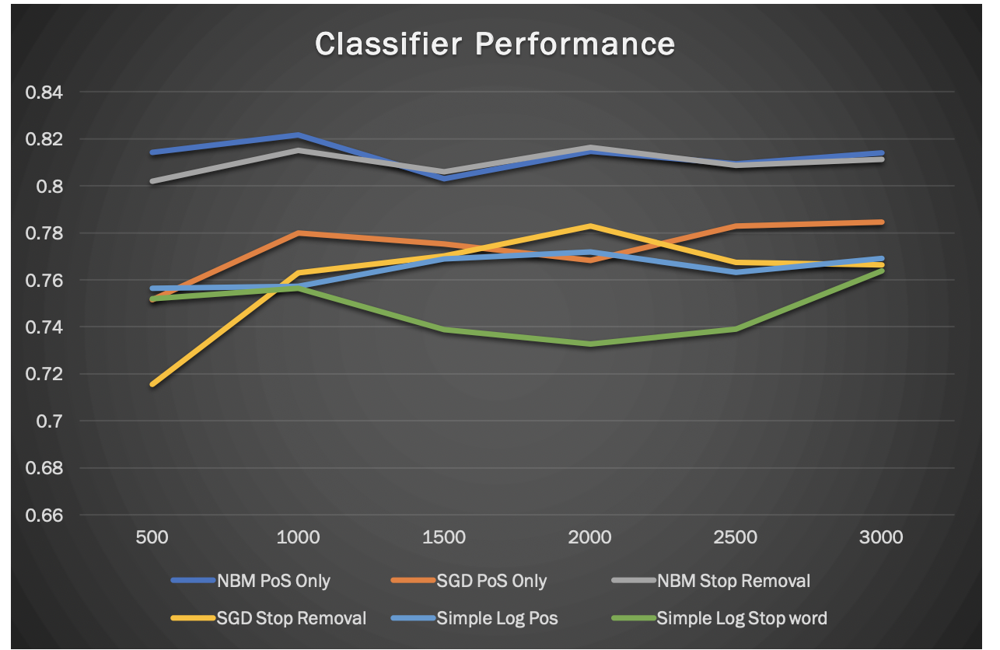

# Sentiment Analysis for Move Reviews
This program is aimed at performing sentiment analysis on the dataset of movie reviews provided by IMDB. Aspects such as Data Analytics, Feature Selection and Machine Learning Classifiers are being implemented. This project is created using java, OpenNLP and the weka machine learning package. 

## Feature Selection
- Feature Selection is the process of selecting a subset of relevant terms that aid in the building of ML models. The feature selection methods implenmeted in this project are:
1. Part of speech tagging
2. Part of speech tagging with stop word removal
3. Document Frequency Cutoff
- The OpenNLP library was used in implementing PoS tagging (Tagging adverbs abd adjectives)
- Document Frequency Cutoff is implemented by me using a HashMap take a look at `FeatureSelection.java`.

## Creating ML Models
- Once the features have been selected two text based machine learning modes are to be built, mainly `Naive Bayes Multinomial` and `Stochastic Gradient Decent`
- For each feature selection method a ML model will be created and a `F-Measure` will be outputted which is basically the accuracy of the model. 

## Results
- The most accurate combination of feature selection and ML model is `Naive Bayes Multinomial` and `PoS tagging` feature selection. With and average F-Measure of `.80`  
- The worst performing combination of feature selection and ML model is `Simple Logistic Classifer` with `Document Frequency Cutoff` with an average F-Measure of `.75`

- NBM = Naive Bayes Multinomial
- SGD = Sthocastic Gradient Decent
- Simple Log = Simple Logistic Classifer 

### For a more detailed report have a look at `Report.pdf`

# To build the whole project run:
 `make`

Reuqired files, please make sure these files are in the root directory: weka.jar opennlp-tools-1.9.1.jar filtered_sentoken/ OpenNLP_models txt_sentoken/

- To run the Bayes classifer on a feature size of 500 with the first feature selection method:
`make run-all-bayes-500`
- To run the Bayes classifier on a feature size of 500 with the second feature selection method:
`make run-all-bayes-stopword-500`

- To run the stocastic gradient decent with a feature size of 500 and the frist feature selection method run:
`make run-all-sgd-500:`
- To run the stocastic gradient decent classifier on a feature size of 500 with the second feature selection method:
`make run-all-sgd-stopword-500`

- To run the simple logistic with a feature size of 500 and the frist feature selection method run:
`make run-all-simplelog-500:`
- To run the simple logistic classifier on a feature size of 500 with the second feature selection method:
`make run-all-simplelog-stopword-500`

